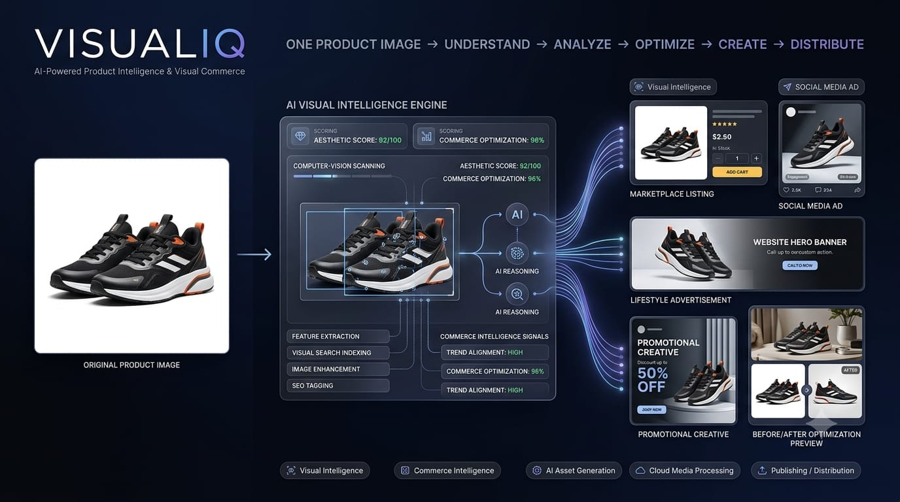
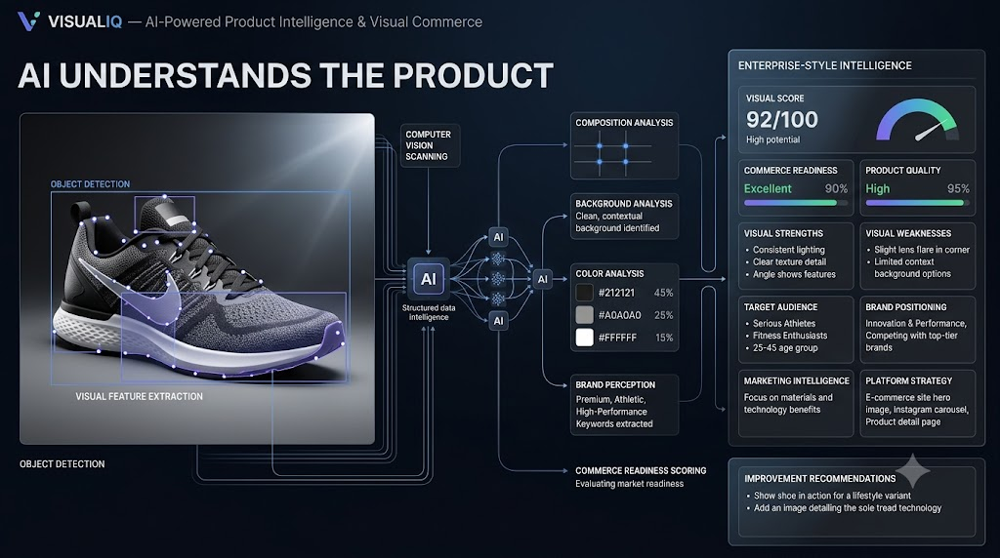
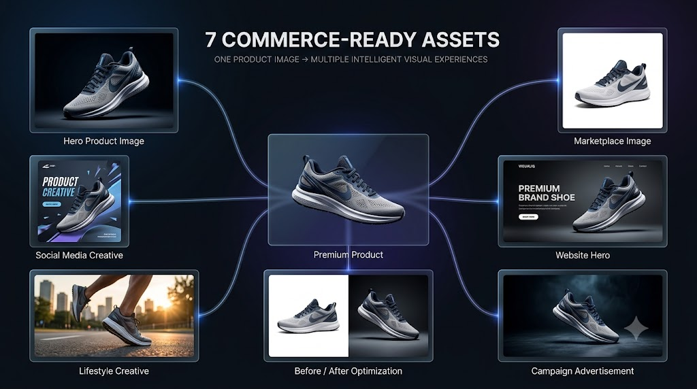
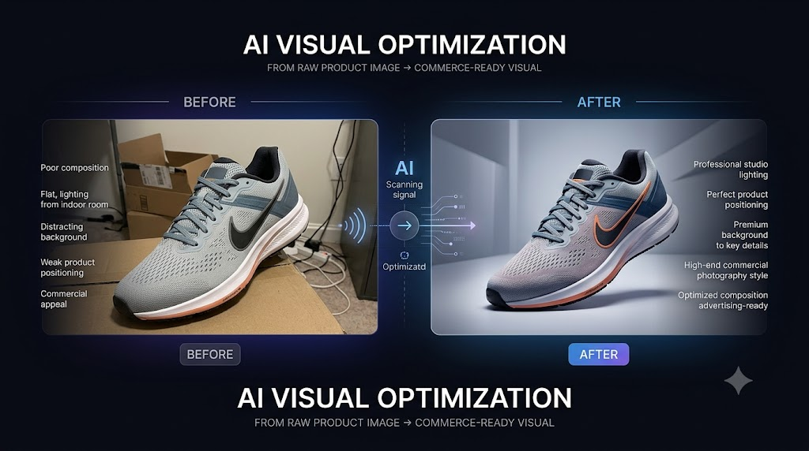
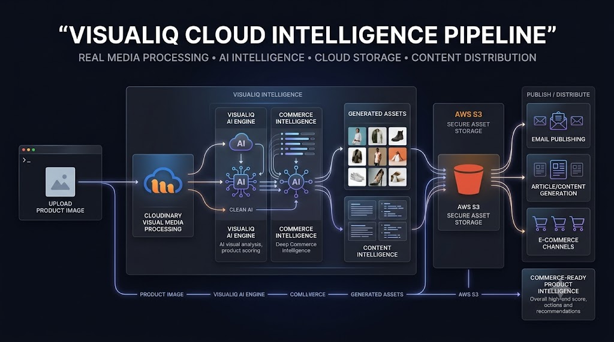
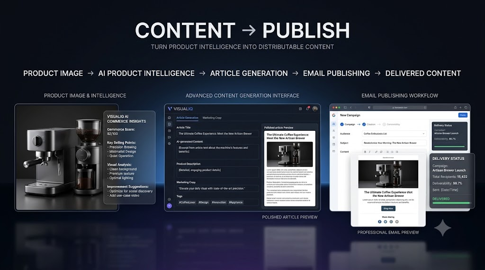

# 🚀 VISUALIQ

## AI-Powered Product Intelligence & Visual Commerce Studio

<p align="center">
  
</p>

<p align="center">

**Transform one product image into intelligent commerce-ready experiences.**

🧠 AI Product Intelligence • 🎨 Visual Commerce • ☁️ Cloud Media • 📊 Scoring • ✍️ Content Generation • 📤 Publishing

</p>

---

## 🌟 What is VISUALIQ?

**VISUALIQ** is an AI-powered visual commerce platform that transforms a single product image into a complete intelligence and content pipeline.

Instead of simply storing or displaying a product image, VISUALIQ:

**UPLOAD → UNDERSTAND → SCORE → ANALYZE → OPTIMIZE → CREATE → PUBLISH**

The platform combines visual intelligence, commerce analysis, Cloudinary media processing, AWS cloud storage, AI-assisted analysis, deterministic intelligence, automated asset generation, and content publishing into one unified workflow.

---

## 🎯 The Core Idea

<p align="center">
  
</p>

A single product image becomes the starting point for a much larger intelligence pipeline.

### 🔍 VISUALIQ understands

* Product identity
* Product category
* Visual quality
* Composition
* Visual strengths
* Visual weaknesses
* Target audience
* Brand positioning
* Marketing intelligence
* Commerce readiness
* Platform strategy
* Improvement opportunities

---

# 🧠 AI PRODUCT INTELLIGENCE

VISUALIQ combines AI-assisted analysis with a deterministic visual commerce intelligence engine.

### Intelligence Layer

| Capability                  | VISUALIQ |
| --------------------------- | -------- |
| Product Understanding       | ✅        |
| Visual Scoring              | ✅        |
| Commerce Readiness          | ✅        |
| Target Audience Analysis    | ✅        |
| Brand Positioning           | ✅        |
| Marketing Intelligence      | ✅        |
| Platform Strategy           | ✅        |
| Improvement Recommendations | ✅        |
| Visual DNA                  | ✅        |
| Creative Strategy           | ✅        |

When live generative AI availability is limited, VISUALIQ maintains a deterministic intelligence fallback so the core product workflow remains usable.

---

# 🎨 ONE IMAGE → 7 COMMERCE ASSETS

<p align="center">
  
</p>

VISUALIQ transforms the product into multiple commerce-ready visual experiences.

### 1️⃣ Hero Product Image

Premium primary product presentation.

### 2️⃣ Social Media Creative

Promotional visual designed for social distribution.

### 3️⃣ Marketplace Image

Clean product-focused marketplace presentation.

### 4️⃣ Website Hero

Wide visual suitable for a premium website or campaign.

### 5️⃣ Lifestyle Creative

Product shown in a realistic contextual environment.

### 6️⃣ Before / After Optimization

Visual comparison showing the transformation from the original image to an optimized presentation.

### 7️⃣ Campaign Advertisement

Cinematic promotional creative for marketing campaigns.

---

# 🔄 AI VISUAL OPTIMIZATION

<p align="center">
  
</p>

VISUALIQ evaluates the original product presentation and identifies opportunities to improve:

* Composition
* Product visibility
* Background quality
* Visual hierarchy
* Commercial presentation
* Marketing appeal
* Commerce readiness

The result is a transformation from:

**RAW PRODUCT IMAGE → COMMERCE-READY VISUAL**

---

# ☁️ CLOUD MEDIA INTELLIGENCE

<p align="center">
  
</p>

VISUALIQ uses cloud infrastructure as part of the actual product workflow.

### ☁️ Cloudinary

Cloudinary handles the visual-media layer of VISUALIQ.

**Used for:**

* Product image upload
* Cloud media processing
* Product asset generation
* Visual asset URLs
* Media transformation workflow

### ☁️ AWS S3

AWS S3 provides cloud storage for original product assets.

**Workflow:**

```text
Product Image
      ↓
VISUALIQ Backend
      ↓
Cloudinary
      ↓
Visual Intelligence
      ↓
Commerce Assets
      ↓
AWS S3
```

This creates a real cloud-backed product media pipeline rather than a simulated integration.

---

# 📤 CONTENT → PUBLISH

<p align="center">
  
</p>

VISUALIQ can transform product intelligence into publishable content.

### ✍️ Article Generation

The publishing engine supports:

* Article title
* Article content
* Excerpt
* Product image
* Tags
* Draft status

### 📧 Email Publishing

VISUALIQ integrates with **Resend** for real article email delivery.

```text
Product Intelligence
        ↓
Article Generation
        ↓
Article Preview
        ↓
Resend
        ↓
Email Delivery
```

The publishing workflow was tested with a real delivery request.

---

# ⚡ VISUALIQ PIPELINE

```text
                ┌─────────────────────┐
                │   PRODUCT IMAGE     │
                └──────────┬──────────┘
                           ↓
                ┌─────────────────────┐
                │    CLOUDINARY       │
                │   MEDIA PROCESSING  │
                └──────────┬──────────┘
                           ↓
                ┌─────────────────────┐
                │ VISUAL INTELLIGENCE │
                │      ENGINE         │
                └──────────┬──────────┘
                           ↓
             ┌─────────────┴─────────────┐
             ↓                           ↓
      ┌──────────────┐            ┌──────────────┐
      │ VISUAL SCORE │            │   COMMERCE   │
      │              │            │ INTELLIGENCE │
      └──────┬───────┘            └──────┬───────┘
             └─────────────┬─────────────┘
                           ↓
                ┌─────────────────────┐
                │ 7 COMMERCE ASSETS   │
                └──────────┬──────────┘
                           ↓
                ┌─────────────────────┐
                │      AWS S3         │
                │   CLOUD STORAGE     │
                └──────────┬──────────┘
                           ↓
                ┌─────────────────────┐
                │ ARTICLE / CONTENT   │
                └──────────┬──────────┘
                           ↓
                ┌─────────────────────┐
                │  EMAIL PUBLISHING   │
                └─────────────────────┘
```

---

# 🧩 KEY FEATURES

### 🖼️ Visual Intelligence

Analyze product images and generate structured visual-commerce intelligence.

### 📊 Visual Scoring

Evaluate the visual quality and commerce readiness of product imagery.

### 🧠 Deep Commerce Intelligence

Generate product positioning, audience insights, marketing intelligence, platform strategies, and improvement recommendations.

### 🎨 Automated Visual Assets

Generate seven different commerce-oriented visual outputs from one product.

### ☁️ Cloudinary Integration

Real cloud-based visual media processing.

### 🪣 AWS S3 Integration

Real cloud storage for original product assets.

### ✍️ Article Engine

Convert product intelligence into structured article content.

### 📧 Email Publishing

Send generated product content through a real email delivery workflow.

### 🛡️ Deterministic Fallback

Maintain usable product intelligence even when generative AI availability is temporarily limited.

---

# 🏗️ TECHNOLOGY STACK

## Frontend

* ⚛️ React
* ⚡ Vite
* 🎨 CSS
* 📦 JavaScript

## Backend

* 🟢 Node.js
* 🚂 Express
* 📦 REST APIs
* 🛡️ Helmet
* 🌐 CORS
* 📤 Multer

## AI / Intelligence

* 🤖 Gemini architecture
* 🧠 Visual intelligence
* 📊 Deterministic commerce intelligence
* 📈 Visual scoring engine

## Cloud

* ☁️ Cloudinary
* 🪣 AWS S3

## Publishing

* 📧 Resend
* ✍️ VISUALIQ Publishing Engine

---

# 📁 PROJECT STRUCTURE

```text
VISUALIQ/
│
├── backend/
│   ├── config/
│   │   ├── aws.js
│   │   └── cloudinary.js
│   │
│   ├── integrations/
│   │   └── publishing/
│   │       ├── email/
│   │       │   ├── emailPublisher.js
│   │       │   ├── emailRoute.js
│   │       │   └── resendService.js
│   │       │
│   │       ├── publishingEngine.js
│   │       └── publishingRoute.js
│   │
│   ├── routes/
│   │   ├── cloudinaryTest.js
│   │   └── upload.js
│   │
│   ├── services/
│   │   ├── commerceFallback.js
│   │   ├── deepCommerceIntelligence.js
│   │   ├── productAI.js
│   │   ├── s3Upload.js
│   │   ├── visualAssets.js
│   │   └── visualScore.js
│   │
│   ├── server.js
│   ├── package.json
│   └── package-lock.json
│
├── frontend/
│   ├── src/
│   │   ├── pages/
│   │   ├── services/
│   │   ├── assets/
│   │   ├── App.jsx
│   │   └── App.css
│   │
│   ├── public/
│   ├── package.json
│   └── vite.config.js
│
├── docs/
│   └── images/
│
├── .gitignore
├── README.md
├── package.json
└── package-lock.json
```

---

# 🔐 SECURITY

VISUALIQ keeps credentials outside the public repository.

Environment variables are excluded through `.gitignore`:

```text
.env
.env.*
!.env.example
```

Never commit:

* AWS access keys
* AWS secret keys
* Cloudinary API secrets
* Gemini API keys
* Resend API keys
* Other private credentials

---

# 🚀 LOCAL DEVELOPMENT

## Backend

```bash
cd backend
npm install
node server.js
```

Backend:

```text
http://localhost:5000
```

Health endpoint:

```text
GET /api/health
```

## Frontend

```bash
cd frontend
npm install
npm run dev
```

The frontend runs through Vite.

---

# 🔌 API WORKFLOW

### Product Upload

```text
POST /api/upload
```

The upload workflow:

```text
Image Upload
     ↓
Cloudinary Upload
     ↓
AWS S3 Storage
     ↓
Visual Scoring
     ↓
Commerce Intelligence
     ↓
Visual Asset Generation
     ↓
AI Analysis Job
     ↓
Structured Response
```

### Article Draft

```text
POST /api/publishing/draft
```

### Email Publishing

```text
POST /api/publishing/email/send
```

---

# 🏆 BUILT FOR AI-POWERED VISUAL COMMERCE

VISUALIQ was designed for the **Pixels to Products — Cloudinary AI Hackathon 2026**.

The project focuses on combining:

**AI + Visual Media + Commerce Intelligence + Cloud Infrastructure + Content Distribution**

rather than building another basic image-generation application.

---

# 🌐 PROJECT

**GitHub Repository**

https://github.com/snehassneha4578-collab/VISUALIQ-AI-Powered-Product-Intelligence

---

# 👩‍💻 BUILT BY

**Sneha S**

B.E. Electronics & Communication Engineering
AI/ML • Embedded Systems • VLSI

Building intelligent systems at the intersection of:

**AI × Cloud × Computer Vision × Product Intelligence × Engineering**

---

# ⭐ VISUALIQ

> **One product image.
> Complete visual intelligence.**

**UNDERSTAND → SCORE → OPTIMIZE → CREATE → PUBLISH**

---

<p align="center">

### 🚀 VISUALIQ — Turning Product Images Into Product Intelligence

</p>
